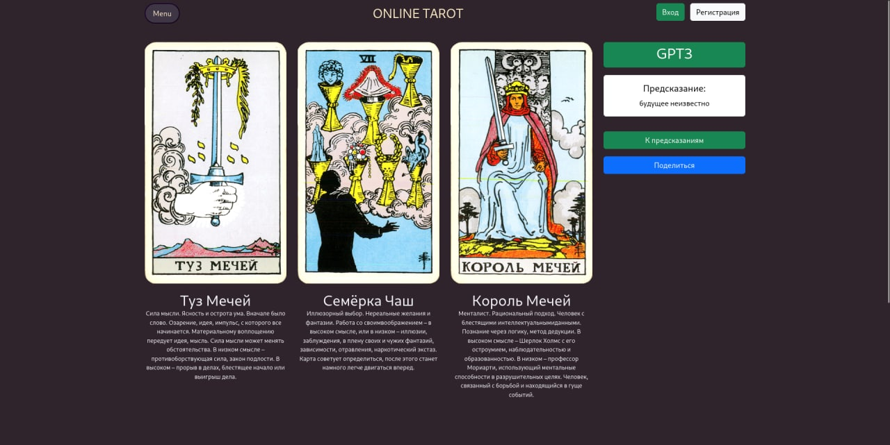
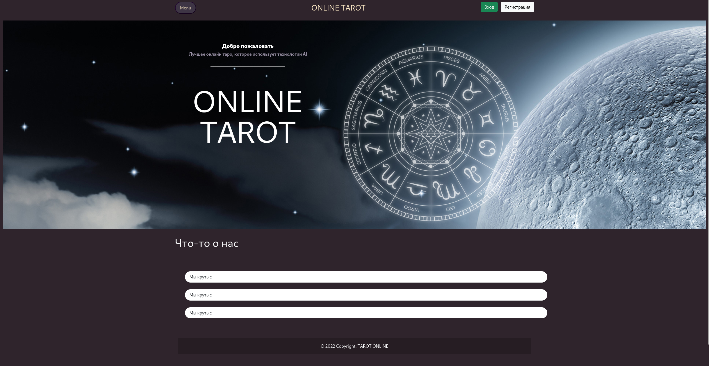

[](https://github.com/Shagulka/tarot-django/actions/workflows/django.yml)
[](https://github.com/Shagulka/tarot-django/actions/workflows/flake8.yml)

# ГАДАНИЕ НА КАРТАХ ТАРО НЕДОРОГО

Сайт с гаданием на картах Таро с помощью GPT-3




## фичи

- гадание на трех картах
- монетки чтобы покупать гадания
- даем монетки каждый день по серверному времени
- гадания с помощью GPT-3

## сделаем позже

- гадание на любое количество карт
- даем монетки каждый день по времени пользователя
- фронт по красоте
- анимацию тасования карт
- анимацию переворота карт
- страницу покупки монеток

## set up the environment and install requirements

create .env file in the root directory of the project (optional)
```bash
cp .env.example .env
```

- ### windows

```ps
python -m venv venv
venv\Scripts\activate
pip install -r requirements.txt
``` 

- ### unix

```bash
python3 -m venv venv
source venv/bin/activate
pip install -r requirements.txt
```

укажите ваш ключ от `openai` в файле `.env`, иначе предсказания не будут работать


## run the project

set up
```bash
cd tarot/
python manage.py migrate
python manage.py createsuperuser
```


run server
```bash
python manage.py runserver
```

создайте гадания на `localhost:8000/admin`
(обратите внимание, что пока что работают гадания только на трех картах)
